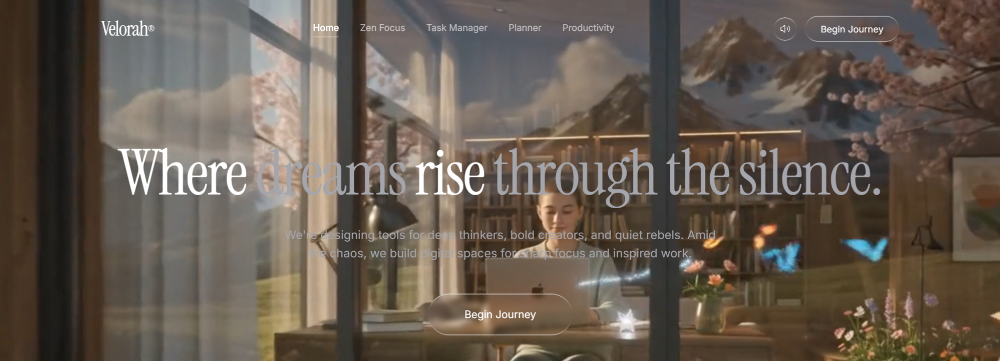

# 🌌 Velorah — Where dreams rise through the silence

Velorah is a premium, minimalist, and focus-oriented digital workspace designed for deep thinkers, bold creators, and quiet rebels. It provides a sanctuary from digital noise, combining immersive nature-inspired visuals, ambient audio controls, and an integrated suite of productivity tools to help you enter and sustain flow state.

<div align="center">
  
  <p><em>Figure 1: Immersive glassmorphic landing page with nature background, glowing accents, and elegant typography.</em></p>
</div>

---

## 💡 The Philosophy

In an era of hyper-distraction, productivity isn't about doing *more*—it's about doing what matters with undivided attention. Velorah provides a digital focus space by:
- **Calming the Mind**: Organic background animations and customizable ambient audio mask external sensory noise.
- **Simplifying Execution**: Streamlined task tracking and hourly time blocking separate planning from doing.
- **Encouraging Reflection**: Visual stats track your focus journey without gamified pressure.

---

## 🚀 Key Features

### 1. Immersive Backdrops & Seamless Looping
* **Landing Page Backdrop**: A beautiful, local cinematic video (`/Create_a_cinematic_ultra_real.mp4`) looping seamlessly in the background.
* **Workspace backdrop**: An atmospheric study-oriented CloudFront video resource loaded dynamically inside the workspace screens.
* **Dual-Video Crossfade Buffer (100% Gapless Loop)**: Built with an advanced overlapping player architecture that pre-buffers the video and crossfades opacity over 1.2 seconds to eliminate native browser looping stutter or gaps.

### 2. High-Contrast Readability & Accessibility
* All text overlays, title elements, and timer numbers feature custom text-shadow backing (`textShadow: "0 2px 12px rgba(0,0,0,0.8)"`) ensuring absolute readability against both light and dark video frames.
* Buttons utilize premium high-contrast styling: unselected options render in dark transparent glassmorphism, and active items render in solid white with black text.

### 3. Integrated Workspace Suite
* **Zen Focus Timer**: Standard focus duration presets alongside a **Custom Timer Input** field allowing you to input any limit from 1 to 720 minutes.
* **Task Manager**: Add, complete, and delete tasks. Press the direct focus launch button on any task to load it directly into your active timer focus session.
* **Daily Planner**: Map specific study activities and goals to chronological hourly slots throughout the day.
* **Productivity Stats**: View your live **Productivity Score** based on completed focus sessions and task checklist updates, total productive hours, and a session log.

### 4. Stateful Audio Control
* An elegant glassmorphic navbar volume toggle allows you to mute or unmute the video's high-fidelity audio track. Mute preference is synced to local storage and persists across sessions.

---

## 🛠️ Technology Stack

* **Frontend Framework**: React (TypeScript) + Vite
* **Styling**: TailwindCSS (with customized glassmorphism utilities)
* **Icons**: Lucide React
* **State Persistence**: HTML5 LocalStorage

---

## 💻 Local Setup & Development

To get Velorah running locally, execute:

```bash
# Install dependencies
npm install

# Start local development server
npm run dev

# Run linter
npm run lint
```
